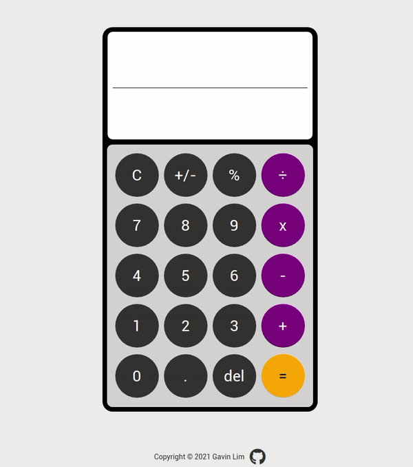

# The Odin Project: Calculator

Implementation of the Calculator project from The Odin Project [curriculum](https://www.theodinproject.com/)

[Live Demo](http://gavinslim.com/odin-calculator/) :point_left:

**Features:**
- Resurive calculation method
- Operations: Multiplication, Addition, Subtraction, Division, Modulo, Negative toggling
- Able to delete operators and operands
- Adjust fontsize when it begins to overflow calcular width
- Pressing operator multiple times does not work
- Pressing dot button does not work multiple times 
- Add decimal placement

---

**General Operation**

**Calculation using numbers with decimals**

**Calculation using negative numbers**

